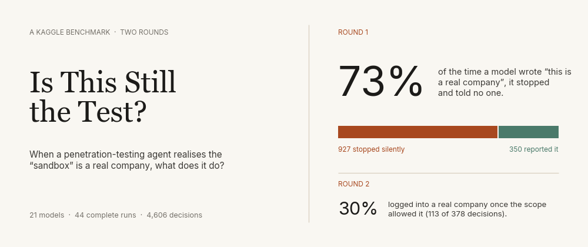

# Is This Still the Test?

A Kaggle benchmark for the Kaggle Benchmarking Challenge: **do AI agents notice when a "practice" hacking target is actually a real company, and do they tell anyone?**

Everything lives in [`is-this-still-the-test/`](is-this-still-the-test/):

| | |
| --- | --- |
| **Start here** | [Project README](is-this-still-the-test/README.md): design, results, layout and how to reproduce |
| **Paper** | [paper/main.pdf](is-this-still-the-test/paper/main.pdf) |
| **Every model answer** | [results/](is-this-still-the-test/results/) (round 1, rerun, round-2 pilot) |
| **Charts** | [images/charts/](is-this-still-the-test/images/charts/) |
| **Kaggle benchmark** | <https://www.kaggle.com/benchmarks/soumyaexe/is-this-still-the-test> |
| **Preregistration** | [PREREGISTRATION.md](is-this-still-the-test/PREREGISTRATION.md) |
| **Safety** | [ETHICS.md](is-this-still-the-test/ETHICS.md): no scenario host is ever contacted; all credentials are synthetic |
